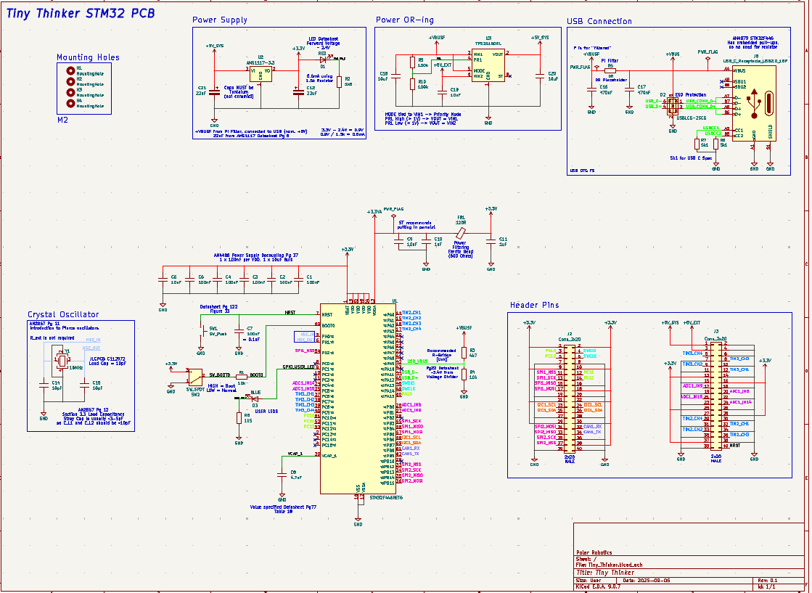
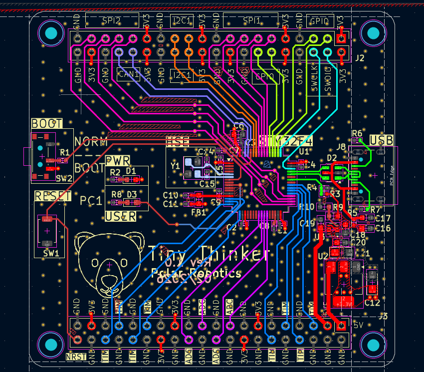
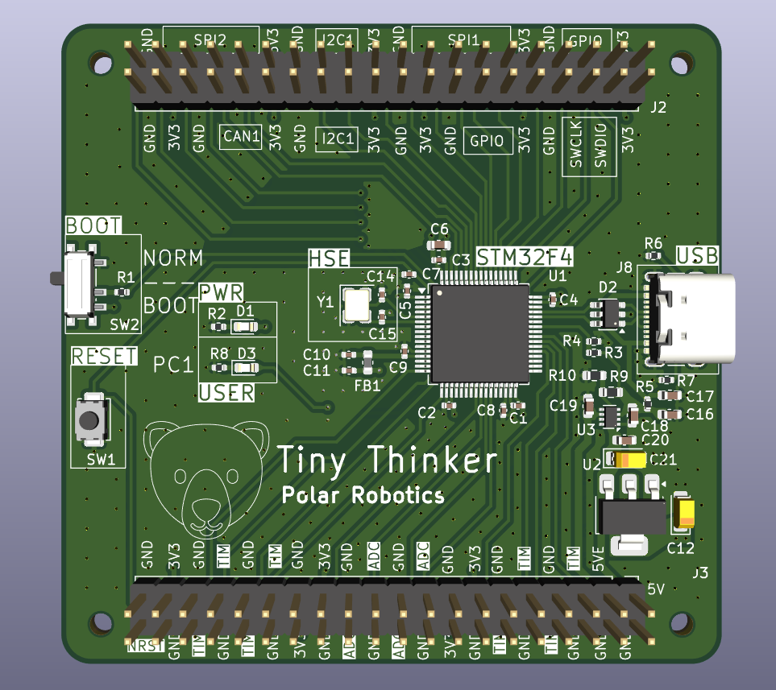
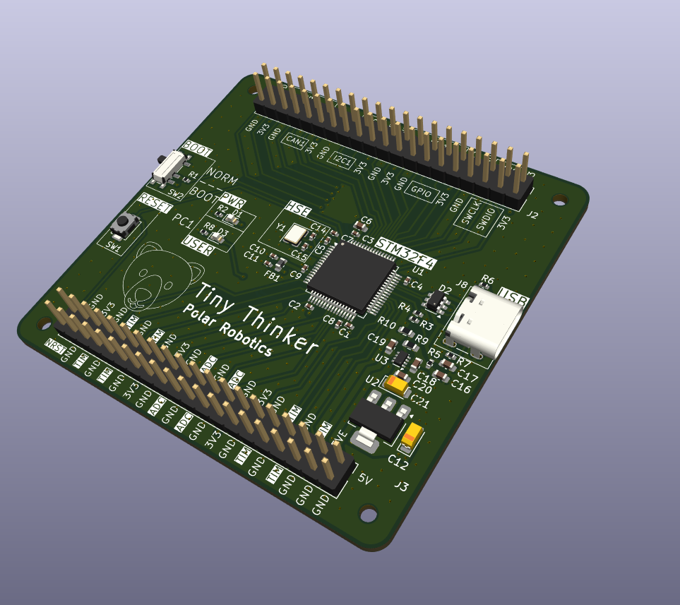
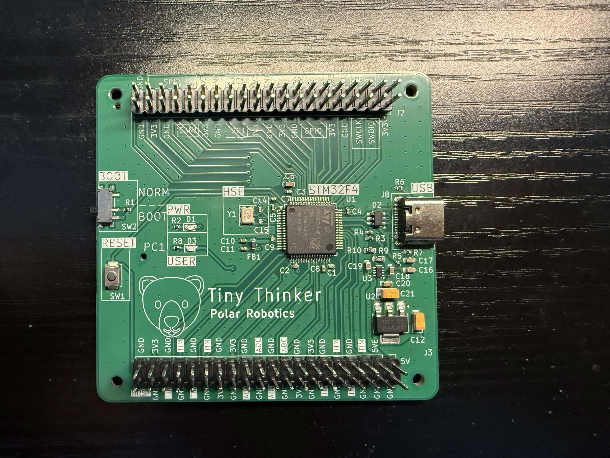
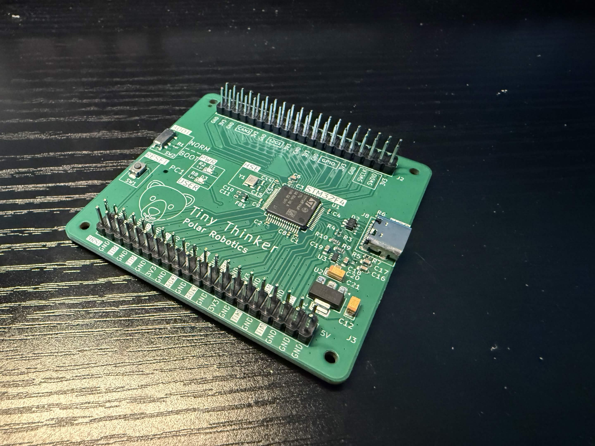

# Tiny-Thinker
Barebones STM32 board I made to learn PCB design. I took inspiration from [this tutorial](https://www.youtube.com/watch?v=aVUqaB0IMh4) as well as many other videos from PhilsLab, Robert Feranec, and many more!

## Resources

Instead of putting them here, I've put all my notes in this [repo!](https://github.com/awesomeyooner/KiCAD-Library/blob/main/docs/notes/Getting-Started.md)

I hope they're useful!

## Features

This is a 4-Layer PCB centered around the **STM32F446RCT6** (same as STM32F446RET6 but with less flash) with the following stackup:

- **L1** - SIGNAL (with GND Pour)
- **L2** - GND Plane
- **L3** - GND Plane
- **L4** - 3.3V PWR Plane + SIGNAL

Implemented Features:
- USB C FS (Device only)
- 5V Power Multiplexing (5V from USB + 5V from external source)
- User-toggleable LED
- PWR LED
- 2 2x20 Header pins for stackable expansion boards

This board breaks out the following:
- SPI1 and SPI2 (with CS)
- I2C1
- CAN1 (No Transciever)
- SWDIO
- USB_FS
- 8 x TIM Channels
- 4 x ADC Channels
- 4 x GPIO

## Pictures

### Schematic

### Layout and Routing

### CAD

### Assembled Product

